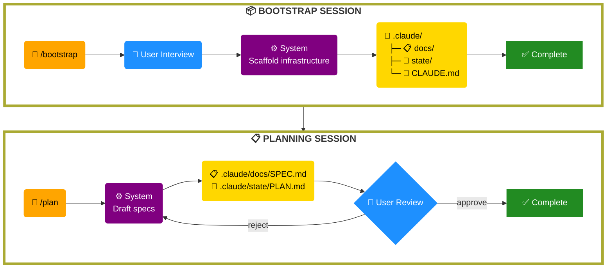
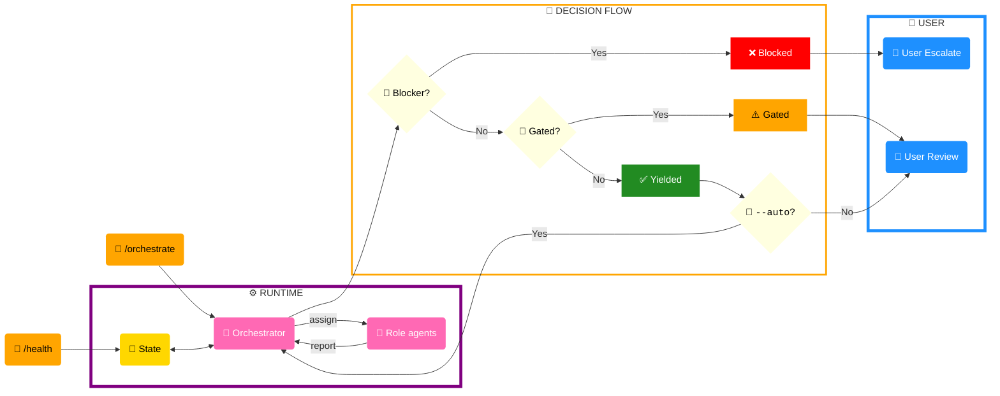
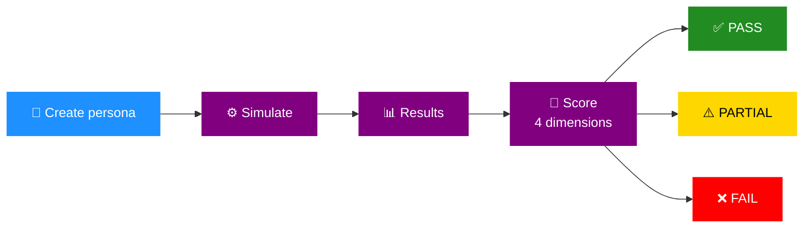

# Bootstrap Architecture Diagrams

---

## Diagram 1: Bootstrap Workflow

---

## Diagram 2: Runtime Workflow

**Runtime note:** State-control skill handles CONTEXT.md curation; callers (orchestrate, health) determine which log type to write (orchestrate writes checkpoint at phase gates; health writes handoff when user escalates to Level 3).

---

## Diagram 3b: Eval Workflow

---

## Scope Boundary

**Bootstrap framework** (diagrams 1–3) — provides methodology templates and patterns. Bootstrap agents operate read-only on project files; write only to `.claude/` and CLAUDE.md.

**Project scope** — downstream agents own runtime tasks, customized skills, and project deliverables.

---

## Quick Reference

**Diagram 1:** User → CLI → System flow across three sessions (Bootstrap, Planning, Runtime), producing key artifacts.

**Diagram 2:** Runtime loop showing how `/orchestrate` and `/health` read/update state, with decision points for hard stops, gates, and yields.

**Diagram 3:** Eval framework execution pipeline: pick scenario → run → capture artifacts → score → pass/partial/fail.

---

## Legend

| Symbol | Color | Meaning |
| --- | --- | --- |
| 🔵 | dodgerblue | User input/decisions |
| 🟠 | orange | CLI interface / Commands |
| 🟣 | purple | System processing |
| 🤖 | hotpink | Agents |
| 🟡 | gold | Data/State |
| 🚪 | lightyellow | Decision gates/conditions |
| ✅ | forestgreen | Pass / Yielded (success) |
| ⚠️ | orange | Partial / Gated (pending decision) |
| ❌ | red | Fail / Blocked (hard stop) |
| 🔧 | — | CLI command / Skill |
| 👤 | — | User / Persona |
| ⚙️ | — | System / Processing |
| 📂 | — | Directory |
| 📋 | — | Documentation / Specs |
| 📄 | — | File |
| 🧠 | — | State / Brain (memory) |
| 📢 | — | Escalation / Alert |
| 👀 | — | Review / Observation |
| 🚨 | — | Alert / Blocker |
| 🔄 | — | Auto / Refresh / Cycle |
| 📊 | — | Results / Analytics |
| 🎯 | — | Score / Target |
| 🚪 | — | Checkpoint / Phase boundary |
